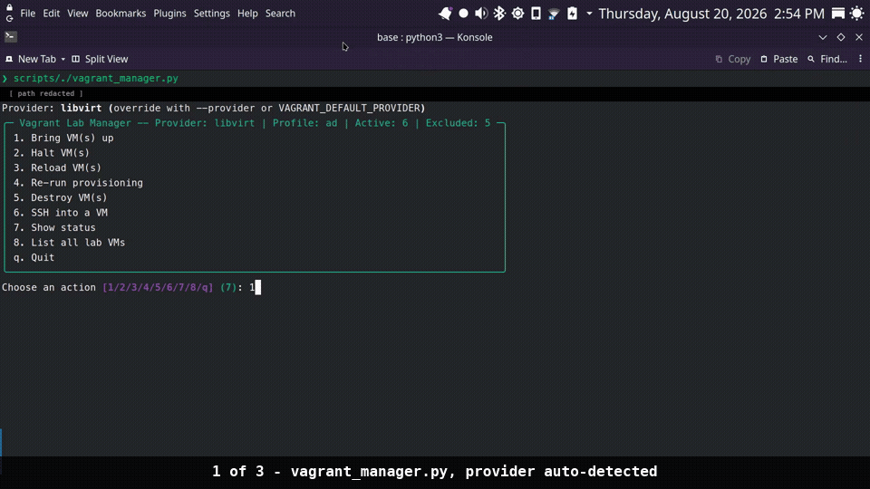
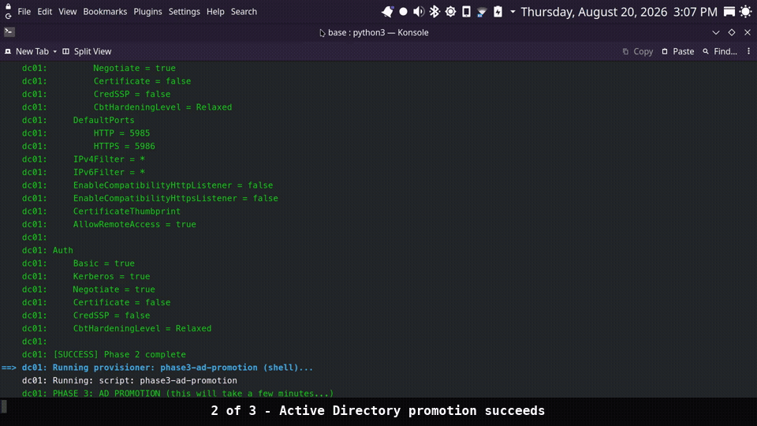
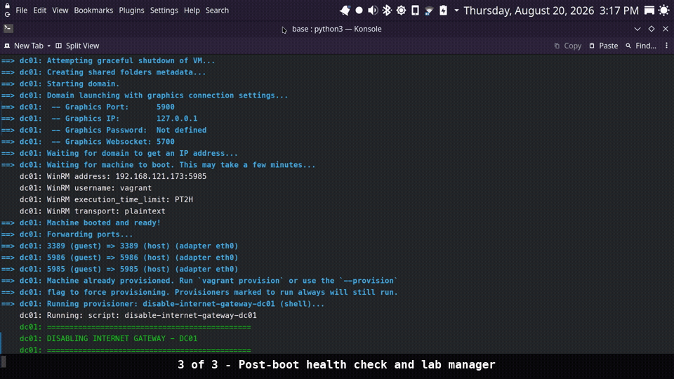
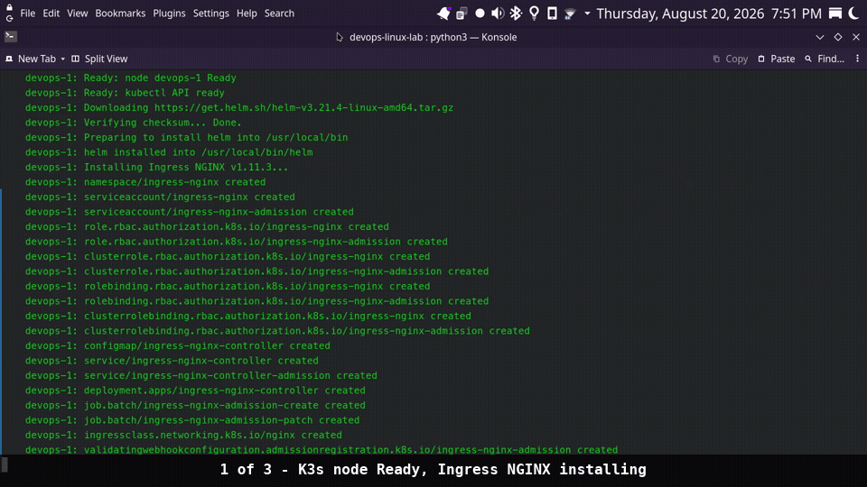
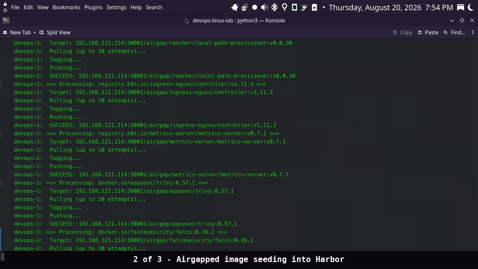
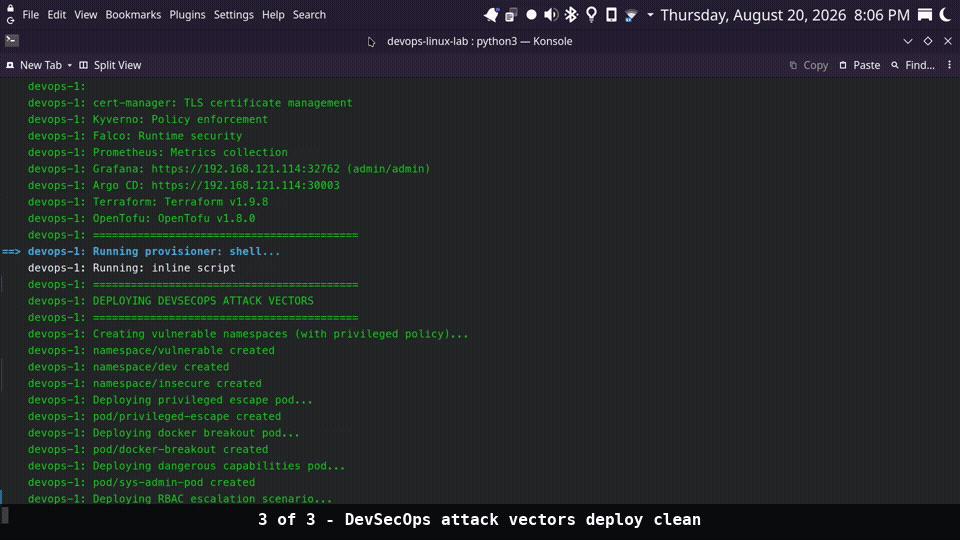
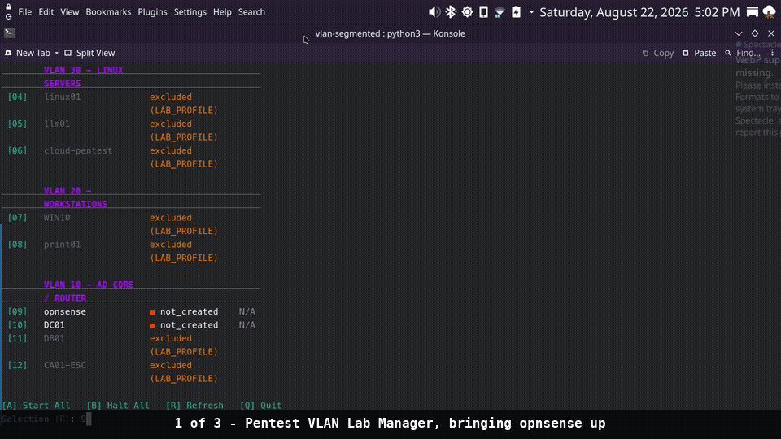
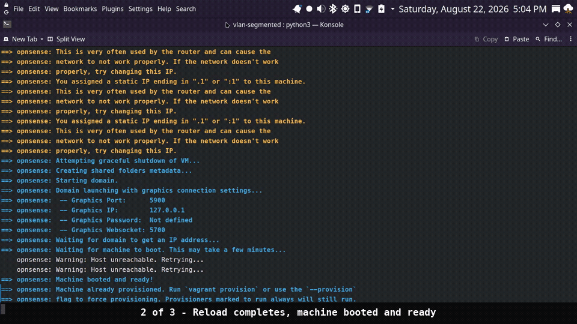
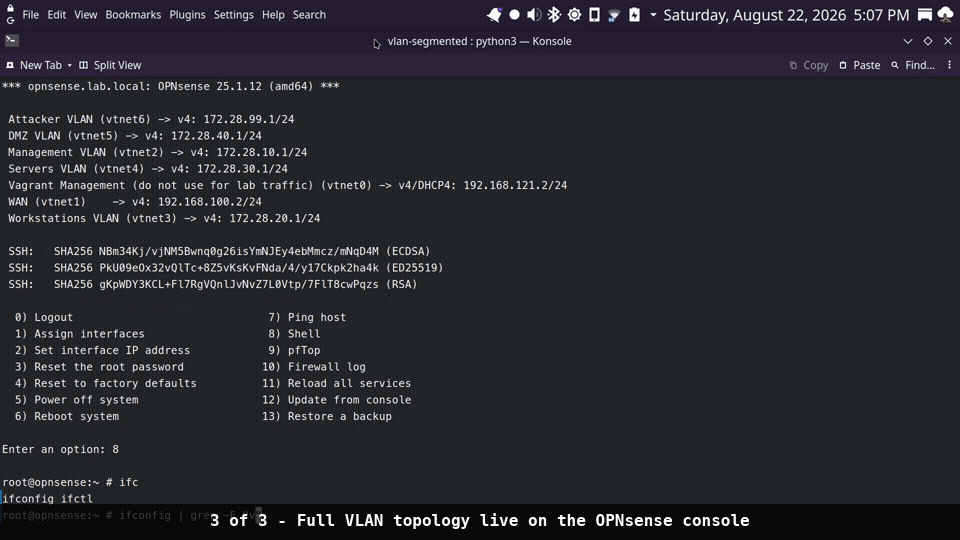
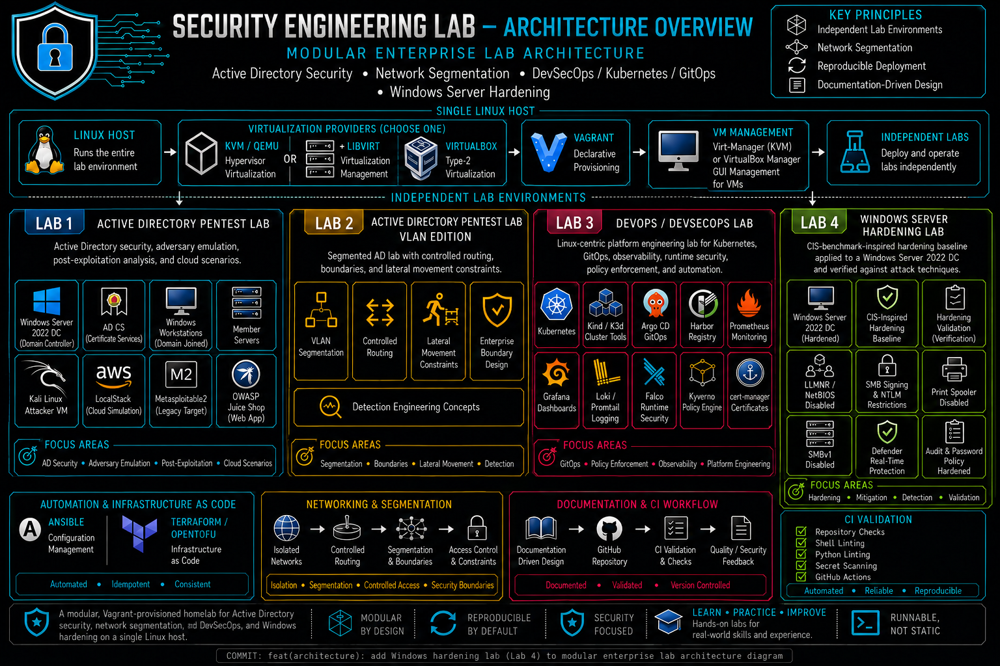

# Security Engineering Lab

[](LICENSE)


[](https://github.com/solo2121/security-engineering-lab/actions/workflows/ci.yml)

**Security Engineering Lab** is a modular, Vagrant-provisioned homelab for authorized Active Directory security research, segmented networking, Kubernetes, DevSecOps workflows, Linux administration, and infrastructure automation.

It is designed to be **runnable, not static**: each environment includes deployable infrastructure, provisioning automation, validation workflows, and supporting technical documentation.

**Maintained by:** Miguel A. Carlo (`solo2121`)  
**Project status:** Active development

> [!IMPORTANT]
> **Supported hosts:** KVM/QEMU with libvirt is the primary provider on Linux. VirtualBox is supported on compatible Intel/AMD x86_64 hosts running Linux, macOS, or Windows. Apple Silicon is not currently validated because the labs depend on architecture-compatible Vagrant boxes, Windows guest workflows, provisioning dependencies, and container images.

---

<details>
<summary>Table of contents</summary>

- [Security Engineering Lab](#security-engineering-lab)
  - [At a glance](#at-a-glance)
  - [Which lab should I start with?](#which-lab-should-i-start-with)
  - [Quick start](#quick-start)
  - [See it in action](#see-it-in-action)
    - [Active Directory base lab](#active-directory-base-lab)
    - [DevOps/DevSecOps lab](#devopsdevsecops-lab)
    - [VLAN-segmented Active Directory lab](#vlan-segmented-active-directory-lab)
  - [Lab environments](#lab-environments)
    - [Active Directory Security Lab](#active-directory-security-lab)
    - [Segmented Active Directory Lab](#segmented-active-directory-lab)
    - [DevOps/DevSecOps platform lab](#devopsdevsecops-platform-lab)
    - [Windows Server Hardening Lab (experimental)](#windows-server-hardening-lab-experimental)
  - [Provider compatibility](#provider-compatibility)
    - [Compatibility matrix](#compatibility-matrix)
    - [Apple Silicon status](#apple-silicon-status)
  - [Prerequisites](#prerequisites)
    - [Host requirements](#host-requirements)
    - [Recommended resources](#recommended-resources)
    - [Vagrant plugins](#vagrant-plugins)
  - [Architecture overview](#architecture-overview)
  - [What this project demonstrates](#what-this-project-demonstrates)
    - [Skills and technologies](#skills-and-technologies)
  - [Common workflows](#common-workflows)
    - [Rebuild a single VM](#rebuild-a-single-vm)
    - [Save and restore snapshots](#save-and-restore-snapshots)
    - [Re-run provisioning](#re-run-provisioning)
    - [Destroy a complete lab](#destroy-a-complete-lab)
    - [Switch providers](#switch-providers)
  - [Troubleshooting](#troubleshooting)
    - [`vagrant up` hangs or times out](#vagrant-up-hangs-or-times-out)
    - [Wrong provider selected](#wrong-provider-selected)
    - [WinRM or SSH connection failures](#winrm-or-ssh-connection-failures)
    - [Network or segmentation conflicts](#network-or-segmentation-conflicts)
  - [Documentation hub](#documentation-hub)
  - [Repository structure](#repository-structure)
  - [Development quickstart](#development-quickstart)
  - [Contributing](#contributing)
  - [Security and ethics](#security-and-ethics)
  - [Known limitations](#known-limitations)
  - [License](#license)

</details>

---

## At a glance

| Item | Details |
|---|---|
| Primary provider | KVM/QEMU with libvirt |
| Alternative provider | VirtualBox on compatible Intel/AMD x86_64 hosts |
| Lab environments | Active Directory, segmented Active Directory, DevOps/DevSecOps, Windows Server hardening (experimental) |
| Automation | Vagrant, Ansible, Bash, and Python |
| Cloud-native stack | K3s, Harbor, Argo CD, Prometheus, Grafana, Loki, Falco, and Kyverno |
| Validation | GitHub Actions, pytest, Bats, ShellCheck, and documentation checks |
| Intended use | Authorized research, defensive security practice, and isolated education |

## Which lab should I start with?

| Lab | Default VMs | Host RAM (min / recommended) | Free disk | Best for |
|---|---:|---|---:|---|
| [Active Directory — base](./labs/security/active-directory/base/) | 6; up to 11 with `LAB_PROFILE=full` | 16 GB / 32 GB+ | 200 GB+ | Learning core AD attack paths, including Kerberoasting, AS-REP roasting, and AD CS abuse, without network segmentation complexity. Start here if you are new to AD security. |
| [Active Directory — VLAN-segmented](./labs/security/active-directory/vlan-segmented/) | 12 | 16 GB / 32 GB+ | 80 GB+ | Practicing lateral movement, routing controls, trust boundaries, and defensive visibility across segmented network boundaries. |
| [DevOps/DevSecOps](./labs/infrastructure/devops-linux-lab/) | 12 | 16 GB for a core cluster / 32 GB+ recommended | 200 GB+ | Kubernetes, Harbor, CI/CD, GitOps, observability, runtime security, policy enforcement, and Linux administration. Not AD-focused. |
| [Windows Server Hardening (experimental)](./labs/security/windows-hardening/) | 1; 2 with `LAB_PROFILE=full` | 8 GB / 16 GB+ | 60 GB+ | Defensive counterpart to the AD base lab — a CIS-benchmark-inspired hardening baseline, each control mapped to a specific attack technique. Start after the AD base lab, not instead of it. |

> [!NOTE]
> Resource figures refer to practical **host capacity**, not only aggregate guest allocations. Reserve additional CPU, RAM, and disk capacity for the host OS, Vagrant/provider overhead, base boxes, snapshots, package caches, and container-image storage.

Before deploying, run:

```bash
./scripts/check-prerequisites.sh --all
```

Or:

```bash
make prereq
```

For the recommended progression from Active Directory fundamentals through segmentation and DevSecOps workflows, see the [Learning Path](./docs/project/learning-path.md).

---

## Quick start

Clone the repository and validate your host:

```bash
git clone https://github.com/solo2121/security-engineering-lab.git
cd security-engineering-lab
./scripts/check-prerequisites.sh --all
```

Start with the Active Directory base lab:

```bash
cd labs/security/active-directory/base
vagrant up --provider=libvirt
```

Use VirtualBox only on a compatible Intel/AMD x86_64 host:

```bash
vagrant up --provider=virtualbox
```

Check the VM state:

```bash
vagrant status
```

Each lab includes a Python-based `vagrant_manager.py` for interactive or scripted VM management:

```bash
python3 vagrant_manager.py
```

Examples:

```bash
python3 vagrant_manager.py up kali dc01
python3 vagrant_manager.py up --provider virtualbox
```

Verify available commands:

```bash
python3 vagrant_manager.py --help
python3 vagrant_manager.py up --help
```

After deployment, follow the selected lab README and health-validation guidance before beginning an exercise. A successful `vagrant up` does not necessarily mean that every guest service, domain role, or Kubernetes component is fully ready.

See the [Installation Guide](./docs/setup/installation.md), [Quickstart Examples](./docs/setup/quickstart-examples.md), and [Learning Path](./docs/project/learning-path.md) for provider setup, deployment patterns, and lab progression.

---

## See it in action

### Active Directory base lab

A complete Active Directory base lab deployment, from provider detection through domain promotion and post-boot health validation.

| 1. Provider auto-detection | 2. AD promotion succeeds | 3. Health check and lab manager |
|---|---|---|
|  |  |  |

### DevOps/DevSecOps lab

A complete Linux DevSecOps deployment, from K3s bootstrap through Harbor image seeding and authorized security-test scenario deployment.

| 1. K3s node ready | 2. Airgapped image seeding | 3. Security-test scenarios deploy |
|---|---|---|
|  |  |  |

### VLAN-segmented Active Directory lab

A complete OPNsense deployment for the segmented Active Directory lab, from initial boot through reload and interface assignment.

| 1. Lab manager starts OPNsense | 2. Reload completes cleanly | 3. Full topology live |
|---|---|---|
|  |  |  |

Full unedited recordings are available for the [Active Directory lab](./assets/demos/dc01.webm), [DevOps lab](./assets/demos/devops1.webm), and [VLAN-segmented lab](./assets/demos/opnsense-vlan.webm).

---

## Lab environments

| Lab | Purpose | Location |
|---|---|---|
| Active Directory Security Lab | Windows enterprise infrastructure, Active Directory security research, identity attack-path simulation, and detection concepts | [labs/security/active-directory/base/](./labs/security/active-directory/base/) |
| Segmented Active Directory Lab | Segmentation-aware Active Directory research, routing controls, trust boundaries, and lateral-movement constraints | [labs/security/active-directory/vlan-segmented/](./labs/security/active-directory/vlan-segmented/) |
| DevOps/DevSecOps Lab | Linux administration, Kubernetes, GitOps, observability, runtime security, and policy enforcement | [labs/infrastructure/devops-linux-lab/](./labs/infrastructure/devops-linux-lab/) |
| Windows Server Hardening Lab (experimental) | CIS-benchmark-inspired defensive hardening, mapped one-to-one against the AD base lab's attack techniques | [labs/security/windows-hardening/](./labs/security/windows-hardening/) |

### Active Directory Security Lab

The base Active Directory lab provides Windows enterprise-style infrastructure for authorized identity security research and defensive validation.

It covers Active Directory Domain Services, Kerberos, LDAP, Active Directory Certificate Services, credential-access simulation, privilege-escalation research, post-compromise workflows, and detection-engineering concepts.

See the [lab README](./labs/security/active-directory/base/) for provider-specific instructions, resource profiles, validation procedures, and authorized security-testing guidance.

### Segmented Active Directory Lab

The VLAN-segmented lab extends the base Active Directory environment with controlled routing, separated trust boundaries, and segmentation-aware security testing.

It supports research into lateral-movement constraints, network-security concepts, detection and response across boundaries, and controlled routing between lab segments.

See the [lab README](./labs/security/active-directory/vlan-segmented/) and [VLAN lab troubleshooting guide](./labs/security/active-directory/vlan-segmented/docs/troubleshooting.md) for deployment and troubleshooting information.

### DevOps/DevSecOps platform lab

The DevOps/DevSecOps platform lab focuses on Linux platform engineering, Kubernetes operations, GitOps, observability, runtime security, policy enforcement, container-security testing, and integrated CI/CD validation.

See the [lab README](./labs/infrastructure/devops-linux-lab/) for provider-specific deployment requirements, resource profiles, and validation guidance.

### Windows Server Hardening Lab (experimental)

A defensive counterpart to the Active Directory base lab: the same base box and AD-promotion pattern, but with a hardening baseline applied instead of intentional misconfigurations. Each control is documented against the specific attack technique it mitigates, using the base lab's own attack guide as the reference point.

This lab is new (v0.1.0 MVP) and has not had the same amount of real-world testing as the labs above — work through the AD base lab first, then use this one to see and validate the defensive side.

See the [lab README](./labs/security/windows-hardening/) and its [hardening guide](./labs/security/windows-hardening/docs/hardening-guide.md) for the full control list, known limitations, and how to validate the baseline.

---

## Provider compatibility

Each lab uses a provider-aware `Vagrantfile` supporting KVM/QEMU with libvirt and VirtualBox, subject to provider-specific requirements.

| Provider | Best for | Start command |
|---|---|---|
| **KVM/libvirt** | Linux hosts with hardware virtualization and nested virtualization support | `vagrant up --provider=libvirt` |
| **VirtualBox** | Compatible Intel/AMD x86_64 hosts running Linux, macOS, or Windows | `vagrant up --provider=virtualbox` |

KVM/libvirt is the primary development provider and generally provides the best performance for CPU-, memory-, storage-, and network-intensive environments.

> [!NOTE]
> “Supported” means the provider workflow is maintained and validated for the documented lab scope. It does not guarantee identical behavior across every host kernel, provider release, Vagrant plugin version, or third-party Vagrant box revision.

### Compatibility matrix

| Component | KVM/libvirt | VirtualBox |
|---|---|---|
| DevOps Linux lab | Supported with `--provider=libvirt` | Supported with `--provider=virtualbox` on compatible x86_64 hosts |
| Active Directory base lab | Supported with `--provider=libvirt` | Supported with `--provider=virtualbox` on compatible x86_64 hosts |
| Active Directory segmented lab | Supported with `--provider=libvirt` | Supported with `--provider=virtualbox` on compatible x86_64 hosts |
| Windows Server Hardening lab (experimental) | Supported with `--provider=libvirt` | Supported with `--provider=virtualbox` on compatible x86_64 hosts |
| Networking | Libvirt networks with automatic detection and fallback configuration | Host-only networking and VirtualBox internal networks |
| Network segmentation | Separate libvirt networks per segment | Isolated internal networks that model segmentation boundaries |
| Disk storage | qcow2 with libvirt storage configuration | VDI attached through a SATA controller |
| Nested virtualization | `host-passthrough` CPU configuration where required | Explicit nested hardware virtualization configuration where supported |
| Graphics | VNC through virtio video, loopback-oriented | VMSVGA or VBoxSVGA with optional GUI support through `LAB_GUI=true` |
| Linked clones | Backing-file images are commonly used | VirtualBox linked clones are supported |
| Guest additions | Not required for libvirt workflows | `vagrant-vbguest` is optional |
| Recommended use | Primary development and performance-sensitive deployments | Cross-platform compatibility on supported x86_64 hosts |

The segmented lab uses separate virtual networks with libvirt and isolated internal networks with VirtualBox. VirtualBox networking models segmentation boundaries but does not reproduce physical IEEE 802.1Q VLAN tagging.

### Apple Silicon status

Oracle provides an Arm64 version of VirtualBox for Apple Silicon Macs. VirtualBox availability alone does not make a Vagrant lab architecture-compatible.

This repository currently supports VirtualBox workflows on compatible Intel/AMD x86_64 hosts. Apple Silicon support requires:

- ARM64-compatible Vagrant boxes
- ARM64 guest media where required
- Multi-architecture container images
- Validated provider configuration for each lab
- Documented deployment and testing workflows

See the [Installation Guide](./docs/setup/installation.md) for provider-specific setup instructions.

---

## Prerequisites

### Host requirements

- **Linux host:** Required for KVM/QEMU with libvirt
- **Linux, macOS, or Windows host:** Supported with VirtualBox on compatible Intel/AMD x86_64 hardware
- **CPU architecture:** Existing Windows Server and most current Vagrant box workflows require Intel/AMD x86_64 compatibility
- **Hardware virtualization:** Intel VT-x or AMD-V enabled in BIOS/UEFI when applicable
- **Vagrant:** Version 2.2 or newer
- **Virtualization provider:** KVM/QEMU with libvirt or VirtualBox 7.0 or newer
- **Python:** Python 3.10 or newer with `pip` for contributor tooling and lab-management utilities
- **Network:** Internet access for initial box, package, and container-image retrieval unless using prepared local or internal mirrors

### Recommended resources

- **Reduced-resource deployments:** At least 16 GB RAM and approximately 100 GB free disk space; availability depends on the selected lab and resource profile
- **Full-profile deployments:** 32 GB or more RAM and approximately 200 GB free disk space
- **CPU:** Multi-core processor with hardware virtualization support
- **Storage:** SSD or NVMe storage is strongly recommended for Kubernetes, Windows Server, and multi-VM workloads

### Vagrant plugins

Install the common plugins required by the selected lab and provider:

```bash
vagrant plugin install vagrant-reload
vagrant plugin install vagrant-winrm
vagrant plugin install vagrant-hostmanager
```

Install the libvirt provider plugin when using KVM/QEMU:

```bash
vagrant plugin install vagrant-libvirt
```

The VirtualBox Guest Additions plugin is optional:

```bash
vagrant plugin install vagrant-vbguest
```

---

## Architecture overview

[](./assets/diagrams/)

The lab environments deploy independently through provider-aware Vagrant configurations. The architecture combines isolated Active Directory environments, segmented virtual networks, Kubernetes workloads, security monitoring, policy enforcement, and validation workflows.

The labs demonstrate:

- Isolated security research environments
- Enterprise-style Active Directory infrastructure
- Segmented network boundaries and controlled routing
- Kubernetes and containerized workloads
- Runtime-security monitoring
- Defensive hardening validation, mapped one-to-one against specific offensive techniques (experimental)
- Reproducible infrastructure deployment
- Automated validation and documentation workflows

See the following documents for architecture details, trust boundaries, and design decisions:

- [Architecture Overview](./docs/architecture/architecture.md)
- [Security Scope](./docs/security-scope.md)
- [Threat Model](./docs/architecture/threat-model.md)
- [Emergency Isolation Runbook](./docs/architecture/emergency-isolation-runbook.md)

---

## What this project demonstrates

| Domain | Capabilities | Location |
|---|---|---|
| Active Directory security | Domain deployment, AD CS, identity attack-path simulation, privilege-escalation research, and post-compromise workflows | `labs/security/active-directory/base/` |
| Network segmentation | VLAN-like boundaries, routing separation, trust relationships, and segmentation-aware security-testing scenarios | `labs/security/active-directory/vlan-segmented/` |
| DevOps/DevSecOps | Kubernetes operations, GitOps, observability, runtime security, and policy enforcement | `labs/infrastructure/devops-linux-lab/` |
| Defensive hardening (experimental) | CIS-benchmark-inspired hardening controls mapped to specific AD attack techniques, with a validation script to check each control | `labs/security/windows-hardening/` |
| Infrastructure as Code | Vagrant, Ansible, Bash, Python, and automation workflows | Repository-wide |
| Security documentation | Architecture, threat models, setup guides, troubleshooting, and learning paths | `docs/` |
| Validation and quality engineering | Python tests, Bash tests, linting, documentation checks, and CI workflows | `.github/`, `tests/`, and `scripts/` |

### Skills and technologies

| Area | Technologies and concepts |
|---|---|
| Linux administration | Ubuntu, Rocky Linux, AlmaLinux, openSUSE |
| Virtualization | KVM, QEMU, libvirt, VirtualBox, Vagrant |
| Infrastructure as Code | Vagrant, Ansible |
| DevOps | Git, GitHub Actions, CI/CD workflows |
| Kubernetes | K3s and Kubernetes administration |
| GitOps | Argo CD |
| Monitoring | Prometheus, Grafana, Loki |
| Runtime security | Falco |
| Policy security | Kyverno |
| Containers | Docker, Harbor |
| Active Directory | Windows Server, Kerberos, LDAP |
| AD CS | Certificate Services and escalation scenarios |
| Detection engineering | MITRE ATT&CK concepts and log analysis |
| Security testing | Nmap, BloodHound, Metasploit, and Hashcat |

---

## Common workflows

Run these commands from the selected lab directory.

> [!WARNING]
> `vagrant destroy -f` permanently removes the selected lab's VMs and may remove provider-managed disks. Save snapshots or export required artifacts before using it.

### Rebuild a single VM

```bash
vagrant destroy dc01 -f
vagrant up dc01
```

### Save and restore snapshots

Create a snapshot before a risky laboratory exercise:

```bash
vagrant snapshot save dc01 clean-install
```

Restore the snapshot:

```bash
vagrant snapshot restore dc01 clean-install
```

### Re-run provisioning

```bash
vagrant provision
```

### Destroy a complete lab

```bash
vagrant destroy -f
```

### Switch providers

Provider switching generally requires destroying and recreating the environment:

```bash
vagrant destroy -f
vagrant up --provider=libvirt
```

Or:

```bash
vagrant destroy -f
vagrant up --provider=virtualbox
```

For complete deployment and lab-management guidance, see:

- [Quickstart Examples](./docs/setup/quickstart-examples.md)
- [Vagrant Management Tutorial](./docs/guides/infrastructure/vagrant-management-tutorial.md)
- [Guides](./docs/guides/)
- Each lab's `docs/attack-guide.md`

---

## Troubleshooting

### `vagrant up` hangs or times out

Confirm the following:

- Hardware virtualization is enabled in BIOS/UEFI where applicable
- The selected virtualization provider is installed and available
- The prerequisites check completes successfully
- The host has sufficient CPU, RAM, and storage
- The selected lab profile is appropriate for available resources
- The selected Vagrant box is compatible with the host architecture

Run:

```bash
./scripts/check-prerequisites.sh --all
```

### Wrong provider selected

A VM created with one provider cannot normally be reused with another provider. Destroy the current environment and recreate it with the intended provider:

```bash
vagrant destroy -f
vagrant up --provider=libvirt
```

### WinRM or SSH connection failures

Windows guests may require additional time for boot, networking, service initialization, and reboot cycles.

Try:

```bash
vagrant up
```

Then re-run provisioning if necessary:

```bash
vagrant provision
```

Also verify that the expected guest interface, provider-assigned address, and architecture-compatible Vagrant box are available.

### Network or segmentation conflicts

Check for stale resources after an interrupted deployment:

- Libvirt bridges and networks
- VirtualBox host-only adapters
- VirtualBox internal-network definitions
- Previously allocated IP ranges
- Conflicting `NETWORK_BASE` settings

A clean redeployment may be required:

```bash
vagrant destroy -f
vagrant up
```

See the [Troubleshooting Guide](./docs/setup/troubleshooting.md) and [VLAN lab troubleshooting guide](./labs/security/active-directory/vlan-segmented/docs/troubleshooting.md) for detailed guidance.

---

## Documentation hub

| Document | Purpose |
|---|---|
| [Documentation Index](./docs/README.md) | Documentation map grouped by topic |
| [Learning Path](./docs/project/learning-path.md) | Recommended progression through the labs |
| [Architecture](./docs/architecture/architecture.md) | Infrastructure design and deployment architecture |
| [Security Scope](./docs/security-scope.md) | Security boundaries and intended use |
| [Threat Model](./docs/architecture/threat-model.md) | Threat-model documentation |
| [Emergency Isolation Runbook](./docs/architecture/emergency-isolation-runbook.md) | Emergency isolation procedures |
| [Roadmap](./docs/project/roadmap.md) | Planned improvements and future development |
| [Portfolio](./docs/project/portfolio.md) | Skills and competencies demonstrated |
| [Dependencies](./docs/dependencies.md) | Project dependencies and requirements |
| [Installation Guide](./docs/setup/installation.md) | Host and provider setup |
| [Quickstart Examples](./docs/setup/quickstart-examples.md) | Rapid deployment patterns |
| [Troubleshooting](./docs/setup/troubleshooting.md) | Common problems and solutions |
| [Lab Reset and Cleanup](./docs/guides/workflows/lab-reset-and-cleanup.md) | Snapshot revert, VM rebuild, full teardown, and host network cleanup |
| [Minimal Resource Deployment](./docs/guides/optimization/minimal-resource-deployment.md) | Reduced-resource deployment guidance |
| [Guides](./docs/guides/) | Security, infrastructure, and deployment guides |
| [Scripts](./scripts/) | Host-readiness and validation helpers |

---

## Repository structure

```text
security-engineering-lab/
├── .github/                # CI workflows, issue templates, and repository automation
├── assets/                 # Architecture diagrams and deployment demonstrations
├── docs/                   # Architecture, setup, security, project, and guide documentation
├── examples/               # Example configurations and reference material
├── labs/
│   ├── infrastructure/
│   │   └── devops-linux-lab/
│   └── security/
│       ├── active-directory/
│       │   ├── base/
│       │   └── vlan-segmented/
│       └── windows-hardening/       # experimental, v0.1.0 MVP
├── scripts/                # Host-readiness, validation, and automation helpers
├── tests/                  # pytest, Bats, and repository validation tests
├── tools/                  # Standalone lab and security utilities
├── CHANGELOG.md
├── CONTRIBUTING.md
├── LICENSE
├── Makefile
├── README.md
├── SECURITY.md
└── pyproject.toml
```

See the [Documentation Index](./docs/README.md) for the complete documentation map and each lab directory for provider-specific deployment instructions.

---

## Development quickstart

Install development dependencies:

```bash
pip install -r requirements-dev.txt
```

Install pre-commit hooks:

```bash
pre-commit install
```

Common Make targets:

```bash
make lint       # ShellCheck and Python linting
make test       # pytest and Bats unit tests
make validate   # Validate lab Vagrantfiles
make security   # Bandit and detect-secrets checks
make docs-refs  # Check for dangling documentation references
```

Additional targets may include:

```bash
make format
make typecheck
make coverage
make validate-repo
make docs
make prereq
```

List all available targets:

```bash
make help
```

See [CONTRIBUTING.md](./CONTRIBUTING.md), the [Tests README](./tests/README.md), the [Scripts README](./scripts/README.md), and [Dependencies](./docs/dependencies.md) for development details.

---

## Contributing

Contributions are welcome.

Before submitting a contribution:

- Open an issue before making major changes
- Keep pull requests focused
- Update documentation when required
- Add or update tests for behavioral changes
- Run relevant lint, test, validation, and documentation checks
- Do not include credentials, secrets, private keys, or sensitive host information
- Follow the repository contribution guidelines

See [CONTRIBUTING.md](./CONTRIBUTING.md) for the complete contributor workflow.

---

## Security and ethics

This project is intended only for:

- Education
- Authorized security research
- Defensive security practice
- Isolated laboratory environments
- Testing systems owned by the operator or explicitly authorized for testing

Only test systems that you own or have explicit permission to assess.

Unauthorized access, testing, scanning, exploitation, credential attacks, or lateral movement against external systems is prohibited.

Intentionally vulnerable workloads and authorized security-test scenarios must remain isolated from production networks and systems.

For additional security information, see:

- [Security Scope](./docs/security-scope.md)
- [Threat Model](./docs/architecture/threat-model.md)
- [SECURITY.md](./SECURITY.md)

---

## Known limitations

- Full-profile deployments require substantial CPU, RAM, and storage.
- Full deployments generally target 32 GB or more RAM and approximately 200 GB free disk space.
- KVM/QEMU with libvirt requires a compatible Linux host.
- VirtualBox support currently targets compatible Intel/AMD x86_64 hosts.
- Apple Silicon support is a future compatibility target and requires ARM64-compatible boxes, guest media, container images, and per-lab validation.
- Windows-based labs use Microsoft evaluation media; users are responsible for complying with applicable Microsoft licensing terms.
- The Windows Server Hardening lab is an experimental v0.1.0 MVP with less real-world testing than the other labs, and does not yet cover AD CS hardening, LAPS, Credential Guard, or automated Sysmon deployment — see that lab's `docs/hardening-guide.md` for the full list of known gaps.
- Third-party Vagrant boxes may change independently.
- CI validates repository quality and selected provider workflows but does not fully deploy every environment on every push.
- The project is designed primarily for a single-host laboratory architecture.

---

## License

This project is licensed under the MIT License.

See [LICENSE](./LICENSE) for the full license text.

Copyright © 2023–2026 Miguel A. Carlo